## Mastering Text-to-Image Diffusion: Recaptioning, Planning, and Generating with Multimodal LLMs - ICML 2024

This repository contains the official implementation of our [RPG](https://openreview.net/forum?id=DgLFkAPwuZ), accepted by ICML 2024.

> [**Mastering Text-to-Image Diffusion: Recaptioning, Planning, and Generating with Multimodal LLMs**](https://openreview.net/forum?id=DgLFkAPwuZ)   
> [Ling Yang](https://yangling0818.github.io/), 
> [Zhaochen Yu](https://github.com/BitCodingWalkin), 
> [Chenlin Meng](https://cs.stanford.edu/~chenlin/),
> [Minkai Xu](https://minkaixu.com/),
> [Stefano Ermon](https://cs.stanford.edu/~ermon/), 
> [Bin Cui](https://cuibinpku.github.io/) 
> <br>**Peking University, Stanford University, Pika Labs**<br>

## Introduction


<table class="center">
    <tr>
    <td width=100% style="border: none">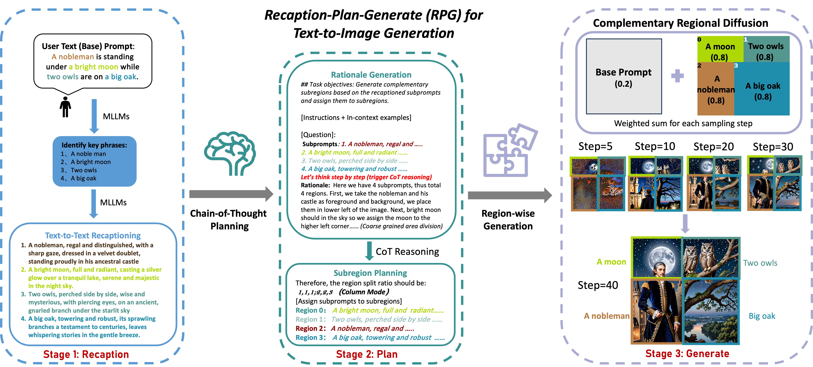</td>
    </tr>
    <tr>
    <td width="100%" style="border: none; text-align: center; word-wrap: break-word">Overview of our RPG
</td>
  </tr>
</table>


**Abstract**: RPG is a powerful training-free paradigm that can utilize proprietary MLLMs (e.g., GPT-4, Gemini-Pro) or open-source local MLLMs (e.g., miniGPT-4) as the **prompt recaptioner and region planner** with our **complementary regional diffusion** to achieve SOTA text-to-image generation and editing. Our framework is very flexible and can generalize to arbitrary MLLM architectures and diffusion backbones. RPG is also capable of generating image with super high resolutions, here is an example:

<table class="center">
    <tr>
    <td width=100% style="border: none">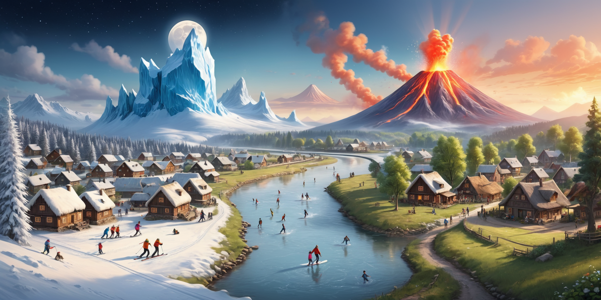</td>
    </tr>
    <tr>
    <td width="100%" style="border: none; text-align: center; word-wrap: break-word">Text prompt: A beautiful landscape with a river in the middle the left of the river is in the evening and in the winter with a big iceberg and a small village while some people are skating on the river and some people are skiing, the right of the river is in the summer with a volcano in the morning and a small village while some people are playing.
</td>
  </tr>
</table>


## 🚩 New Updates 

**[2024.1]** Our main code along with the demo release, supporting different diffusion backbones (**SDXL**, **SD v2.0/2.1** **SD v1.4/1.5**), and one can reproduce our good results utilizing GPT-4 and Gemini-Pro. Our RPG is also compatible with local MLLMs, and we will continue to improve the results in the future.

**[2024.4]** Our codebase has been updated based on [diffusers](https://github.com/huggingface/diffusers), it now supports both ckpts and diffusers of diffusion models. As for diffusion backbones, one can use **RegionalDiffusionPipeline** for base models like **SD v2.0/2.1** **SD v1.4/1.5**, and use **RegionalDiffusionXLPipeline** for SDXL.

**[2024.10]** We enhance RPG by incorporating a more powerful **composition-aware backbone**, [IterComp](https://arxiv.org/abs/2410.07171), significantly improving performance on compositional generation without additional computational costs. Simply update the model path using the command below to obtain the results:

```
pipe = RegionalDiffusionXLPipeline.from_pretrained("comin/IterComp",torch_dtype=torch.float16, use_safetensors=True)
```


## Gallery

### 1. Multi-people with complex attribute binding

<details open>
<summary>1024*1024 Examples</summary> 
<table class="center">
    <tr>
    <td width=25% style="border: none">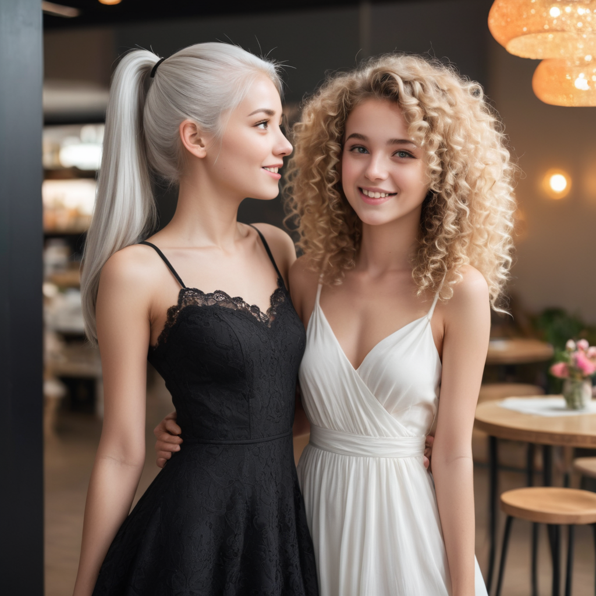</td>
    <td width=25% style="border: none">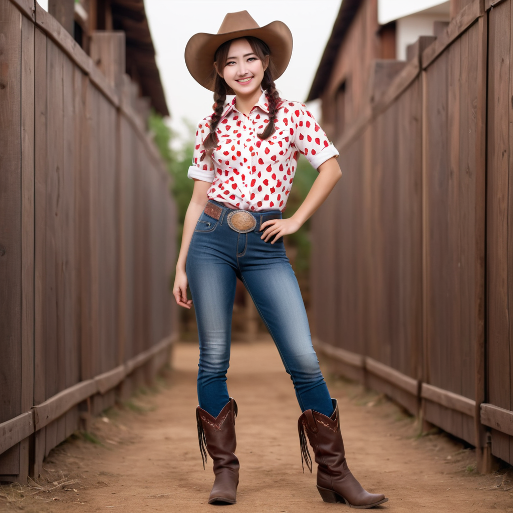</td>
    <td width=25% style="border: none">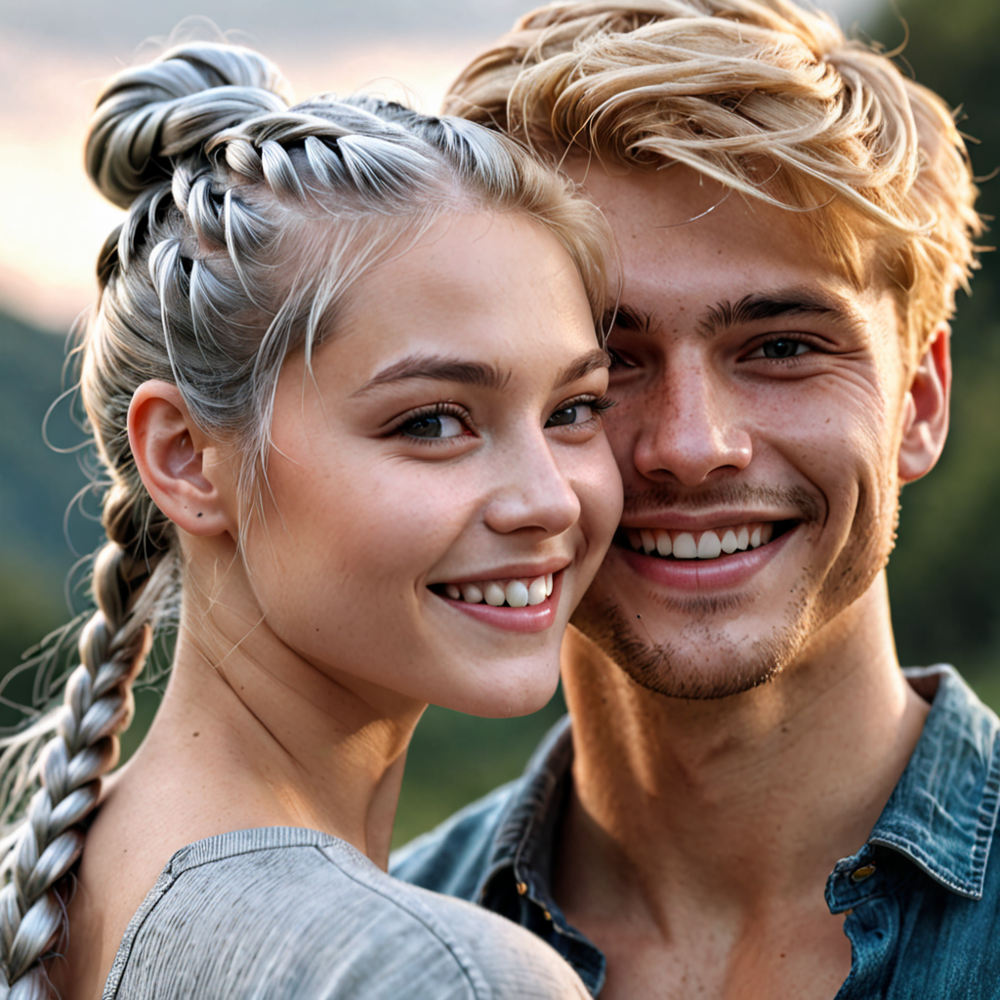</td>
    <td width=25% style="border: none">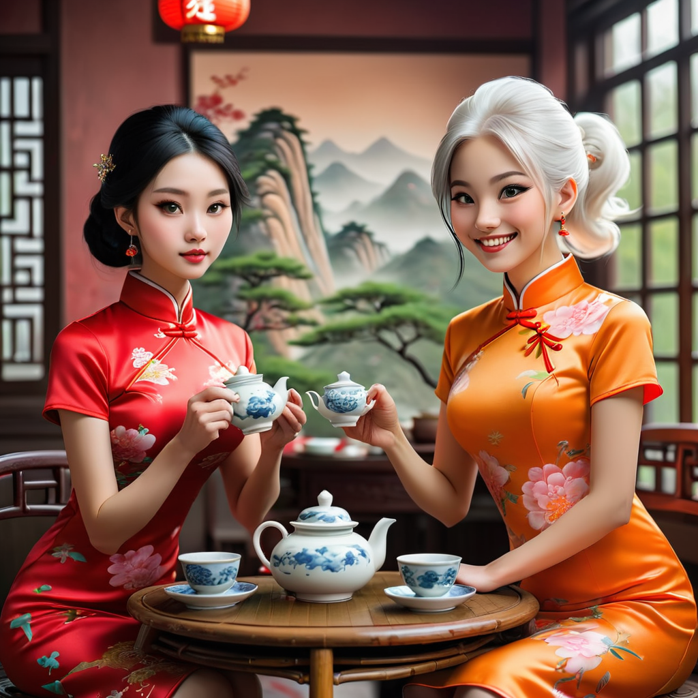</td>
  <tr>
    <td width="25%" style="border: none; text-align: center; word-wrap: break-word">A girl with white ponytail and black dress are chatting with a blonde curly hair girl in a white dress in a cafe.</td>
    <td width="25%" style="border: none; text-align: center; word-wrap: break-word">A twin-tail girl wearing a brwon cowboy hat and white shirt printed with apples, and blue denim jeans with knee boots,full body shot.</td>
    <td width="25%" style="border: none; text-align: center; word-wrap: break-word">A couple, the beautiful girl on the left, silver hair, braided ponytail, happy, dynamic, energetic, peaceful, the handsome young man on the right detailed gorgeous face, grin, blonde hair, enchanting</td>
    <td width="25%" style="border: none; text-align: center; word-wrap: break-word"> Two beautiful Chinese girls wearing cheongsams are drinking tea in the tea room, and a Chinese Landscape Painting is hanging on the wall, the girl on the left is black ponytail in red cheongsam, the girl on the right is white ponytail in orange cheongsam</td>
  </tr>
</table>
    </details>

<details open>
<summary> 2048*1024 Example</summary> 
<table class="center">
    <tr>
    <td width=100% style="border: none"></td>
    </tr>
    <tr>
    <td width="100%" style="border: none; text-align: center; word-wrap: break-word">From left to right, a blonde ponytail Europe girl in white shirt, a brown curly hair African girl in blue shirt printed with a bird,  an Asian young man with black short hair in suit are walking in the campus happily.</td>
  </tr>
</table>
</details>    

### 2. Multi-object with complex relationship

<details open>
<summary> 1024*1024 Examples</summary> 
<table class="center">
    <tr>
    <td width=25% style="border: none"></td>
    <td width=25% style="border: none"></td>
    <td width=25% style="border: none">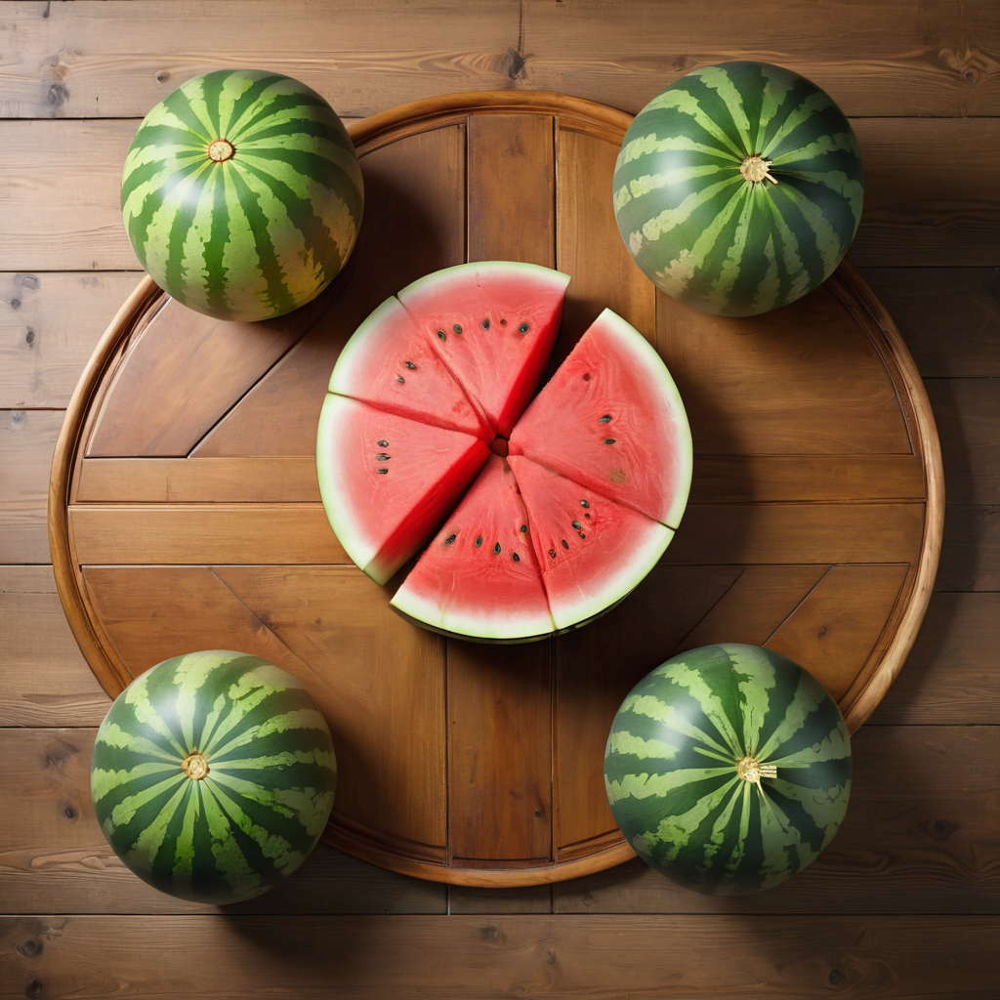</td>
    <td width=25% style="border: none">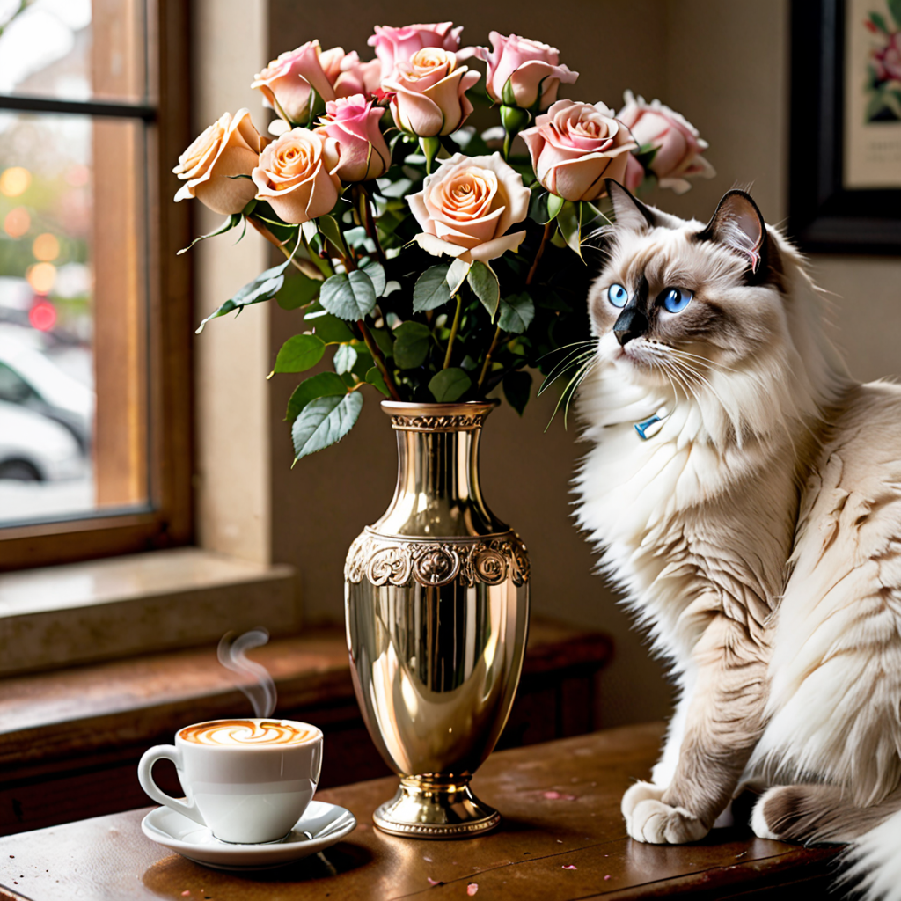</td>
    <tr>
    <td width="25%" style="border: none; text-align: center; word-wrap: break-word">From left to right, two red apples and an apple printed shirt and an ipad on the wooden floor 
</td>
    <td width="25%" style="border: none; text-align: center; word-wrap: break-word">Seven white ceramic mugs with different geometric patterns on the marble table while a bunch of rose on the left
</td>
    <td width="25%" style="border: none; text-align: center; word-wrap: break-word">Five watermelons arranged in X shape on a wooden table, with the one in the middle being cut, realistic style, top down view.
        </td>
    <td width="25%" style="border: none; text-align: center; word-wrap: break-word"> From left to right ,bathed in soft morning light,a cozy nook features a steaming Starbucks latte on a rustic table beside an elegant vase of blooming roses,while a plush ragdoll cat purrs contentedly nearby,its eyes half-closed in blissful serenity.</td>
  </tr>
</table>
</details>   

<details open>
<summary> 2048*1024 Example</summary> 
<table class="center">
    <tr>
    <td width=100% style="border: none">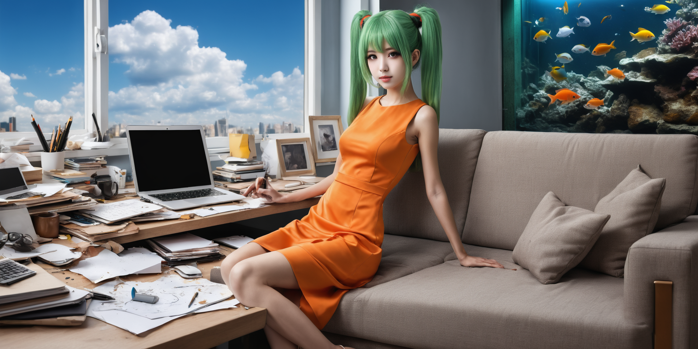</td>
    </tr>
    <tr>
    <td width="100%" style="border: none; text-align: center; word-wrap: break-word">A green twintail girl in orange dress is sitting on the sofa while a messy desk under a big window on the left, a lively aquarium is on the top right of the sofa, realistic style
</td>
  </tr>
</table>
</details>

### 3. RPG With ControlNet

<details open>
<summary>Open Pose Example</summary>
<table class="center">
    <tr style="line-height: 0">
    <td colspan="2" style="border: none; text-align: center">Open Pose</td>
    </tr>
    <tr>
    <td style="border: none">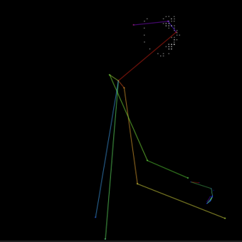</td>
    <td style="border: none">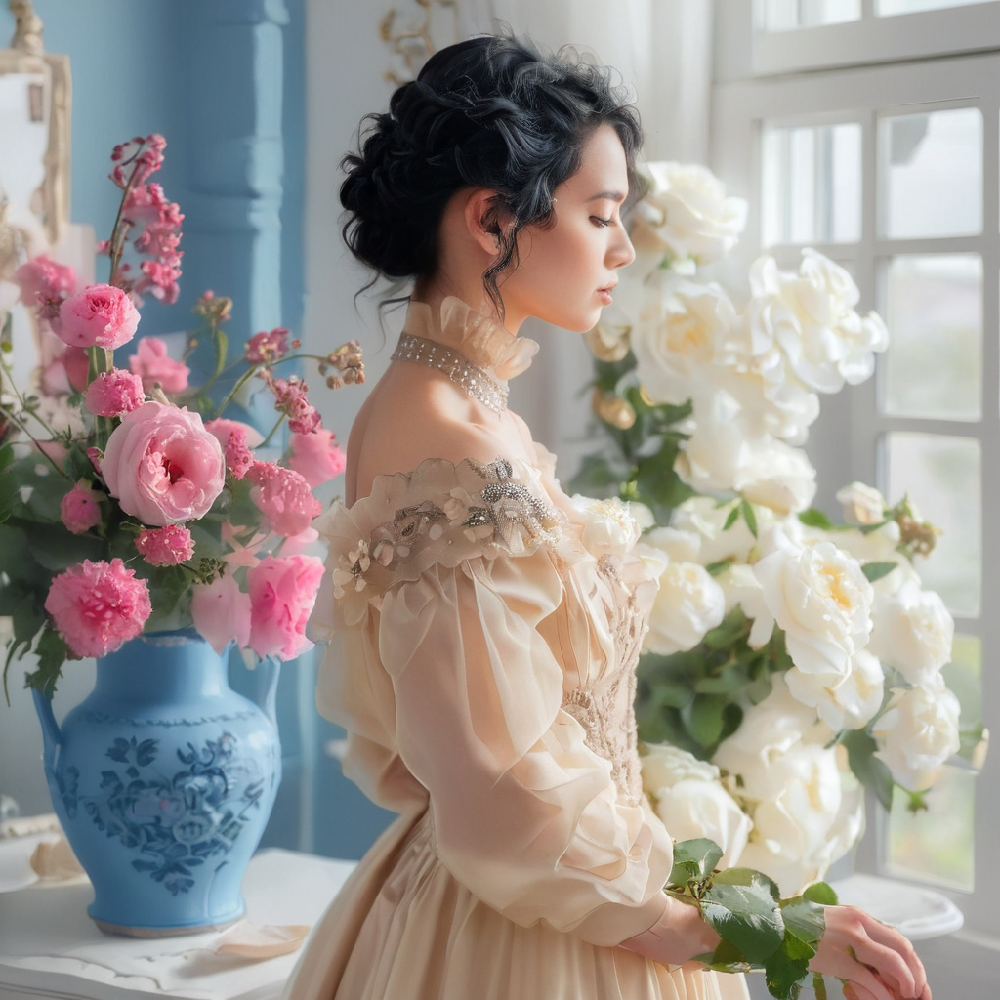</td>
    </tr>
    </table>
Text prompt: A beautiful black hair girl with her eyes closed in champagne long sleeved formal dress standing in her bright room with delicate blue vases with pink roses on the left and some white roses, filled with upgraded growth all around on the right.
</details>

<details open>
<summary>Depth Map Example</summary> 
<table class="center">
    <tr style="line-height: 0">
    <td colspan="2" style="border: none; text-align: center">Depth Map</td>
    </tr>
    <tr>
    <td style="border: none"></td>
    <td style="border: none"></td>
    </tr>
    </table>
Text prompt: Under the clear starry sky, clear river water flows in the mountains, and the lavender flower sea dances with the wind, a peaceful, beautiful, and harmonious atmosphere.
</details>

<details open>
<summary>Canny Edge Example </summary>
<table class="center">
    <tr style="line-height: 0">
    <td colspan="2" style="border: none; text-align: center">Canny Edge</td>
    </tr>
    <tr>
    <td style="border: none">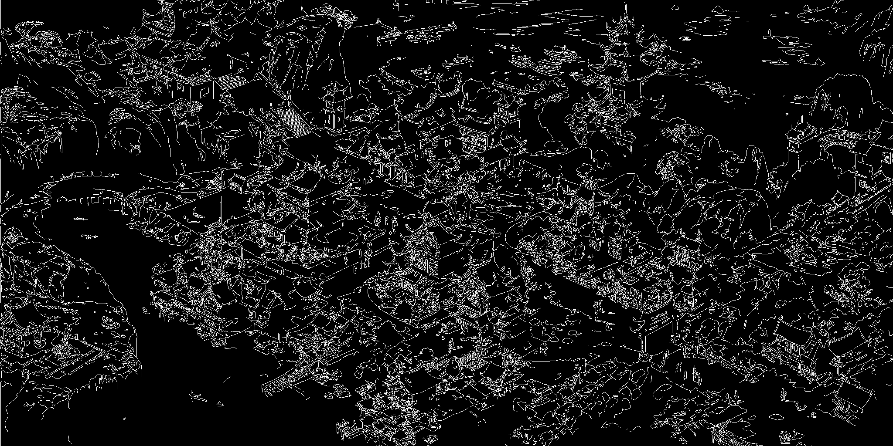</td>
    <td style="border: none"></td>
    </tr>
    </table>
Text prompt: From left to right, an acient Chinese city in spring, summer, autumn and winter in four different regions
</details>

### 4. Enhance RPG with IterComp

<details open>
<summary>1024*1024 Examples</summary> 
<table class="center">
    <tr>
    <td width=50% style="border: none">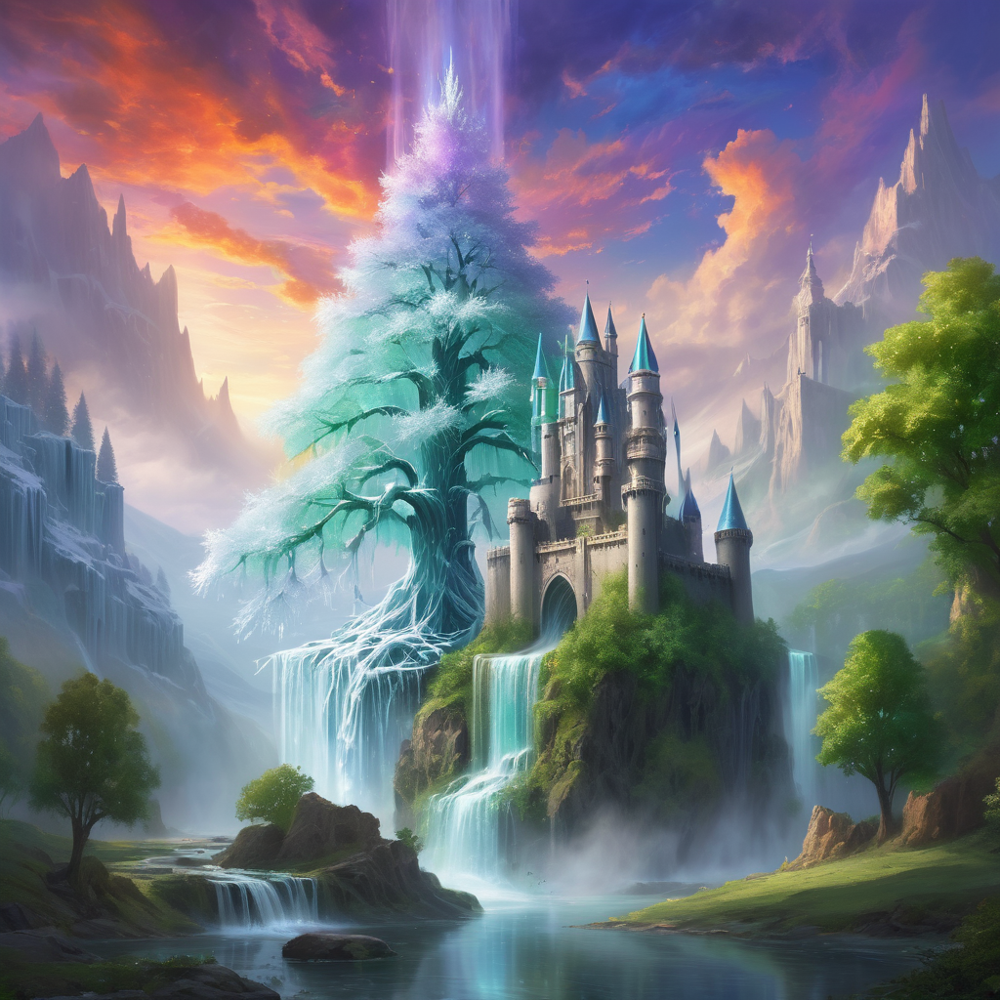</td>
    <td width=50% style="border: none">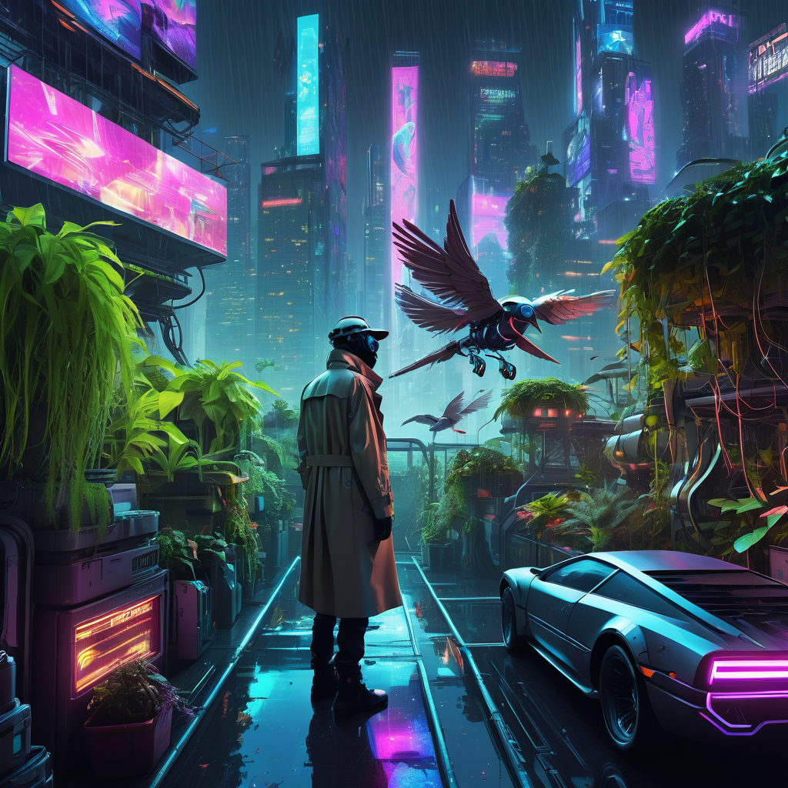</td>
  <tr>
    <td width="50%" style="border: none; text-align: left; word-wrap: break-word">A colossal, ancient tree with leaves made of ice towers over a mystical castle. Green trees line both sides, while cascading waterfalls and an ethereal glow adorn the scene. The backdrop features towering mountains and a vibrant, colorful sky.</td>
    <td width="50%" style="border: none; text-align: left; word-wrap: break-word">On the rooftop of a skyscraper in a bustling cyberpunk city, a figure in a trench coat and neon-lit visor stands amidst a garden of bio-luminescent plants, overlooking the maze of flying cars and towering holograms. Robotic birds flit among the foliage, digital billboards flash advertisements in the distance.</td>
</tr>
</table>
</details>
    
<details open>
<summary>Compared with RPG</summary> 
<table class="center" style="width: 100%; border-collapse: collapse;">
  <tr>
    <td width="50%" style="border: none; text-align: center; word-wrap: break-word">RPG</td>
    <td width="50%" style="border: none; text-align: center; word-wrap: break-word">RPG with IterComp</td>
  </tr>
  <tr>
    <td width="50%" style="border: none">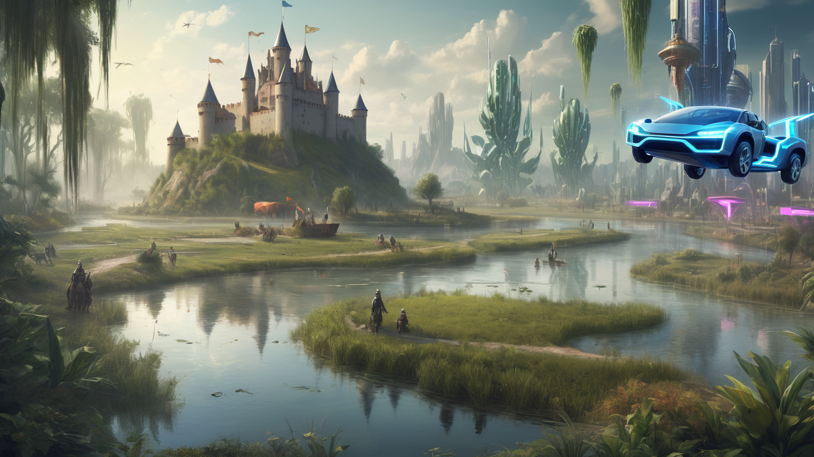</td>
    <td width="50%" style="border: none"></td>
  </tr>
  <tr>
    <td colspan="2" style="border: none; text-align: left; word-wrap: break-word">
      Futuristic and prehistoric worlds collide: Dinosaurs roam near a medieval castle, flying cars and advanced skyscrapers dominate the skyline. A river winds through lush greenery, blending ancient and modern civilizations in a surreal landscape.
    </td>
  </tr>
</table>
</details>

## Preparations

**1. Set Environment**

```bash
git clone https://github.com/YangLing0818/RPG-DiffusionMaster
cd RPG-DiffusionMaster
conda create -n RPG python==3.9
conda activate RPG
pip install -r requirements.txt
git clone https://github.com/huggingface/diffusers
```

**2. Download Diffusion Models and MLLMs**

To attain SOTA generative capabilities, we mainly employ [SDXL](https://huggingface.co/stabilityai/stable-diffusion-xl-base-1.0),  [SDXL-Turbo](https://huggingface.co/stabilityai/sdxl-turbo), and [Playground v2](https://huggingface.co/playgroundai/playground-v2-1024px-aesthetic) as our base diffusion. To generate images of high fidelity across various styles, such as photorealism, cartoons, and anime, we incorporate the models from [CIVITA](https://civitai.com/).  For images aspiring to photorealism, we advocate the use of [AlbedoBase XL](https://civitai.com/models/140737/albedobase-xl?modelVersionId=281176) , and [DreamShaper XL](https://civitai.com/models/112902/dreamshaper-xl?modelVersionId=251662). Moreover, we generalize our paradigm to SD v1.5 and SD v2.1. All checkpoints are accessible within our [Hugging Face spaces](https://huggingface.co/BitStarWalkin/RPG_models), with detailed descriptions. 

We recommend the utilization of GPT-4 or Gemini-Pro for users of Multilingual Large Language Models (MLLMs), as they not only exhibit superior performance but also reduce local memory. According to our experiments, the minimum requirements of VRAM is 10GB with GPT-4, if you want to use local LLM, it would need more VRAM. For those interested in using MLLMs locally, we suggest deploying [miniGPT-4](https://github.com/Vision-CAIR/MiniGPT-4) or directly engaging with substantial Local LLMs such as [Llama2-13b-chat](https://huggingface.co/meta-llama/Llama-2-13b-chat-hf) and  [Llama2-70b-chat](https://huggingface.co/meta-llama/Llama-2-70b-chat-hf). 


## Text-to-Image Generation

#### 1. Quick Start

For individuals equipped with constrained computational resources, we here provide a simple notebook demonstration that partitions the image into two equal-sized subregions. By making minor alterations to select functions within the diffusers library, one may achieve commendable outcomes utilizing base diffusion models such as SD v1.4, v1.5, v2.0, and v2.1, as mentioned in our paper. Additionally, you can apply your customized configurations to experiment with a graphics card possessing 8GB of VRAM. For an in-depth exposition, kindly refer to our [Example_Notebook](RegionalDiffusion_playground.ipynb).

#### **2. Regional Diffusion with GPT-4**
Our method can automatically generates output without pre-storing MLLM responses, leveraging Chain-of-Thought reasoning and high-quality in-context examples to obtain satisfactory results. Users only need to specify some parameters. For example, to use GPT-4 as the region planner, we can refer to the code below, contained in the [RPG.py](RPG.py) ( **Please note that we have two pipelines which support different model architectures, for SD v1.4/1.5/2.0/2.1 models, you should use RegionalDiffusionPipeline, for SDXL models, you should use RegionalDiffusionXLPipeline.** ):

```python
from RegionalDiffusion_base import RegionalDiffusionPipeline
from RegionalDiffusion_xl import RegionalDiffusionXLPipeline
from diffusers.schedulers import KarrasDiffusionSchedulers,DPMSolverMultistepScheduler
from mllm import local_llm,GPT4
import torch
# If you want to load ckpt, initialize with ".from_single_file".
pipe = RegionalDiffusionXLPipeline.from_single_file("path to your ckpt",torch_dtype=torch.float16, use_safetensors=True, variant="fp16")
# If you want to use diffusers, initialize with ".from_pretrained".
# pipe = RegionalDiffusionXLPipeline.from_pretrained("path to your diffusers",torch_dtype=torch.float16, use_safetensors=True, variant="fp16")
pipe.to("cuda")
pipe.scheduler = DPMSolverMultistepScheduler.from_config(pipe.scheduler.config,use_karras_sigmas=True)
pipe.enable_xformers_memory_efficient_attention()
## User input
prompt= ' A handsome young man with blonde curly hair and black suit  with a black twintail girl in red cheongsam in the bar.'
para_dict = GPT4(prompt,key='...Put your api-key here...')
## MLLM based split generation results
split_ratio = para_dict['Final split ratio']
regional_prompt = para_dict['Regional Prompt']
negative_prompt = "" # negative_prompt, 
images = pipe(
    prompt=regional_prompt,
    split_ratio=split_ratio, # The ratio of the regional prompt, the number of prompts is the same as the number of regions
    batch_size = 1, #batch size
    base_ratio = 0.5, # The ratio of the base prompt    
    base_prompt= prompt,       
    num_inference_steps=20, # sampling step
    height = 1024, 
    negative_prompt=negative_prompt, # negative prompt
    width = 1024, 
    seed = None,# random seed
    guidance_scale = 7.0
).images[0]
images.save("test.png")
```

**prompt** is the original prompt that roughly summarize the content of the image

**base_prompt** sets base prompt for generation, which is the summary of the image, here we set the base_prompt as the original input prompt by default

**base_ratio** is the weight of the base prompt

There are also other common optional parameters:

**guidance_scale** is the classifier-free guidance scale

**num_inference_steps** is the steps to generate an image

**seed** controls the seed to make the generation reproducible

It should be noted that we introduce some important parameters: **base_prompt & base_ratio** 

After adding your **prompt and api-key**, and setting your **path to downloaded diffusion model**, just run the following command and get the results:

```bash
python RPG.py
```

**FAQ: How to set --base_prompt & --base_ratio properly ?**

If you want to generate an image with **multiple entities with the same class** (e.g., two girls, three cats, a man and a girl), you should use **base prompt** and set base prompt that includes the number of each class of entities in the image using **base_prompt**. Another relevant parameter is **base_ratio** which is the weight of the base prompt. According to our experiments, when base_ratio is in [0.35,0.55], the final results are better.  Here is the generated image for command above:

And you will get an image similar to ours results as long as we have the same random seed:

<table class="center">
    <tr>
    <td width=100% style="border: none">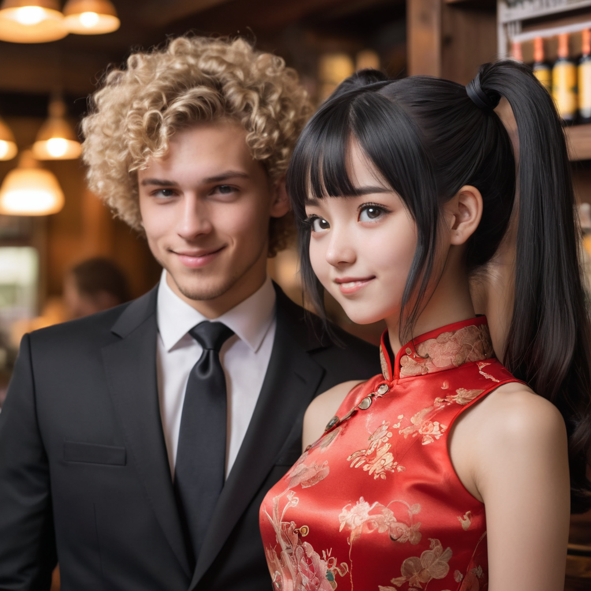</td>
    </tr>
    <tr>
    <td width="100%" style="border: none; text-align: center; word-wrap: break-word">Text prompt: A handsome young man with blonde curly hair and black suit  with a black twintail girl in red cheongsam in the bar.
</td>
  </tr>
</table>

On the other hand, when it comes to an image including **multiple  entities  with different classes**, there is no need to use base prompt, here is an example:

```python
from RegionalDiffusion_base import RegionalDiffusionPipeline
from RegionalDiffusion_xl import RegionalDiffusionXLPipeline 
from diffusers.schedulers import KarrasDiffusionSchedulers,DPMSolverMultistepScheduler
from mllm import local_llm,GPT4
import torch
# If you want to load ckpt, initialize with ".from_single_file".
pipe = RegionalDiffusionXLPipeline.from_single_file("path to your ckpt",torch_dtype=torch.float16, use_safetensors=True, variant="fp16")
# #If you want to use diffusers, initialize with ".from_pretrained".
# pipe = RegionalDiffusionXLPipeline.from_pretrained("path to your diffusers",torch_dtype=torch.float16, use_safetensors=True, variant="fp16")
pipe.to("cuda")
pipe.scheduler = DPMSolverMultistepScheduler.from_config(pipe.scheduler.config,use_karras_sigmas=True)
pipe.enable_xformers_memory_efficient_attention()
prompt= 'From left to right, bathed in soft morning light,a cozy nook features a steaming Starbucks latte on a rustic table beside an elegant vase of blooming roses,while a plush ragdoll cat purrs contentedly nearby,its eyes half-closed in blissful serenity.'
para_dict = GPT4(prompt,key='your key')
split_ratio = para_dict['Final split ratio']
regional_prompt = para_dict['Regional Prompt']
negative_prompt = ""
images = pipe(
    prompt=regional_prompt,
    split_ratio=split_ratio, # The ratio of the regional prompt, the number of prompts is the same as the number of regions, and the number of prompts is the same as the number of regions
    batch_size = 1, #batch size
    base_ratio = 0.5, # The ratio of the base prompt    
    base_prompt= None, # If the base_prompt is None, the base_ratio will not work
    num_inference_steps=20, # sampling step
    height = 1024, 
    negative_prompt=negative_prompt, # negative prompt
    width = 1024, 
    seed = None,# random seed
    guidance_scale = 7.0
).images[0]
images.save("test.png")
```

  And you will get an image similar to our results:

<table class="center">
    <tr>
    <td width=100% style="border: none"></td>
    </tr>
    <tr>
    <td width="100%" style="border: none; text-align: center; word-wrap: break-word">Text prompt: From left to right, bathed in soft morning light,a cozy nook features a steaming Starbucks latte on a rustic table beside an elegant vase of blooming roses,while a plush ragdoll cat purrs contentedly nearby,its eyes half-closed in blissful serenity.
</td>
  </tr>
</table>

It's important to know when should we use **base_prompt**, if these parameters are not set properly, we can not get satisfactory results. We have conducted ablation study about base prompt in our paper, you can check our paper for more information.

#### **3. Regional Diffusion with local LLMs**

We recommend to use base models with over 13 billion parameters for high-quality results, but it will increase load times and graphical memory use at the same time. We have conducted experiments with three different sized models. Here we take llama2-13b-chat as an example:

```python
from RegionalDiffusion_base import RegionalDiffusionPipeline
from RegionalDiffusion_xl import RegionalDiffusionXLPipeline
from diffusers.schedulers import KarrasDiffusionSchedulers,DPMSolverMultistepScheduler
from mllm import local_llm,GPT4
import torch
# If you want to use single ckpt, use this pipeline
pipe = RegionalDiffusionXLPipeline.from_single_file("path to your ckpt",torch_dtype=torch.float16, use_safetensors=True, variant="fp16")
# If you want to use diffusers, use this pipeline
# pipe = RegionalDiffusionXLPipeline.from_pretrained("path to your diffusers",torch_dtype=torch.float16, use_safetensors=True, variant="fp16")
pipe.to("cuda")
pipe.scheduler = DPMSolverMultistepScheduler.from_config(pipe.scheduler.config,use_karras_sigmas=True)
pipe.enable_xformers_memory_efficient_attention()
prompt= 'Two girls are chatting in the cafe.'
para_dict = local_llm(prompt,model_path='path to your model') 
split_ratio = para_dict['Final split ratio']
regional_prompt = para_dict['Regional Prompt']
negative_prompt = ""
images = pipe(
    prompt=regional_prompt,
    split_ratio=split_ratio, # The ratio of the regional prompt, the number of prompts is the same as the number of regions, and the number of prompts is the same as the number of regions
    batch_size = 1, #batch size
    base_ratio = 0.5, # The ratio of the base prompt    
    base_prompt= prompt,       
    num_inference_steps=20, # sampling step
    height = 1024, 
    negative_prompt=negative_prompt, # negative prompt
    width = 1024, 
    seed = 1234,# random seed
    guidance_scale = 7.0
).images[0]
images.save("test.png")
```

In local version, after adding your prompt and setting your path to diffusion model and your path to the local MLLM/LLM, just the command below to get the results:

```
python RPG.py 
```


# 📖BibTeX
```
@inproceedings{yang2024mastering,
  title={Mastering Text-to-Image Diffusion: Recaptioning, Planning, and Generating with Multimodal LLMs},
  author={Yang, Ling and Yu, Zhaochen and Meng, Chenlin and Xu, Minkai and Ermon, Stefano and Cui, Bin},
  booktitle={International Conference on Machine Learning},
  year={2024}
}
```

# Acknowledgements
Our RPG is a general MLLM-controlled text-to-image generation/editing framework, which is builded upon several solid works. Thanks to [AUTOMATIC1111](https://github.com/AUTOMATIC1111/stable-diffusion-webui), [regional-prompter](https://github.com/hako-mikan/sd-webui-regional-prompter), [SAM](https://github.com/facebookresearch/segment-anything), [diffusers](https://github.com/huggingface/diffusers)
and [IA](https://github.com/geekyutao/Inpaint-Anything) for their wonderful work and codebase! We also thank Hugging Face for sharing our [paper](https://huggingface.co/papers/2401.11708). 
